# DISCRAFT Pluto SDR Digital Voice Walkie-Talkie

<p align="center">
  
</p>

<p align="center">
  <b>Low-latency digital voice over ADALM-PLUTO + GNU Radio</b><br>
  Live microphone → speech conditioning → Opus → FEC → differential QPSK → software/RF channel → synchronization → FEC → Opus → speaker
</p>

<p align="center">
  
  
  
  
  
</p>

---

## 1. What this project is

This repository implements a software-defined digital voice transceiver for the **Analog Devices ADALM-PLUTO** using **GNU Radio Companion (GRC)**.

The design is intentionally split into two operating stages:

1. **Hardware-free development mode** — the microphone, digital modem, channel impairments, synchronization, decoder and audio output all run on the host PC. No Pluto is required.
2. **Pluto RF mode** — the same canonical flowgraph retains Pluto TX and RX blocks for later cabled or authorized over-the-air testing.

The important idea is that the project is not merely an audio encoder connected to an SDR. It implements a complete communications chain:

```text
Audio
  ↓
Source coding
  ↓
Framing + integrity
  ↓
Forward error correction
  ↓
Interleaving
  ↓
Digital modulation
  ↓
Pulse shaping
  ↓
RF/channel
  ↓
Frequency recovery
  ↓
Timing recovery
  ↓
Demodulation
  ↓
FEC + CRC
  ↓
Source decoding
  ↓
Audio
```

The current development configuration uses **live microphone input** even when no Pluto is connected. The RF propagation portion is simulated in software.

---

## 2. Canonical project entry point

There is one primary flowgraph:

```text
pluto_digital_voice_hd.grc
```

Open it with:

```bash
gnuradio-companion ./pluto_digital_voice_hd.grc
```

The flowgraph contains:

- live microphone input
- speech conditioning
- Opus encoder
- packet framing
- CRC32
- convolutional FEC
- block interleaving
- QPSK symbol processing
- differential modulation
- RRC pulse shaping inside the GNU Radio constellation modulator
- Pluto TX block
- software channel model
- Pluto RX block
- frequency recovery
- symbol timing recovery
- carrier recovery
- QPSK decision
- differential decoding
- frame synchronization
- Viterbi decoding
- CRC validation
- sequence-aware Opus decoding with PLC
- live audio output
- live spectrum / constellation / FLL / power / audio visualizations

The Pluto source and sink are present but **disabled by default**, so opening the dashboard does not require a connected SDR.

---

# 3. High-level architecture

## 3.1 End-to-end communications flow

```mermaid
flowchart LR
    MIC["Live Microphone<br/>16 kHz mono"] --> PRE["Audio conditioning<br/>DC block + HPF + LPF + gain + limiter"]
    PRE --> OPUS["Opus<br/>16 kbps CBR<br/>20 ms"]
    OPUS --> FRAME["Framing<br/>Sequence + CRC32"]
    FRAME --> FEC["Rate-1/2 convolutional FEC<br/>K=7"]
    FEC --> INT["22 × 34 block interleaver"]
    INT --> MOD["Differential QPSK<br/>RRC α = 0.25"]
    MOD --> CHANNEL["RF / Software Channel"]

    CHANNEL --> SYNC["RX synchronization<br/>FLL + RRC + Gardner + Costas"]
    SYNC --> DEMOD["QPSK decision<br/>+ differential decode"]
    DEMOD --> RXFEC["Frame sync + deinterleave<br/>Viterbi + CRC32"]
    RXFEC --> RXOPUS["Opus decode<br/>packet-loss concealment"]
    RXOPUS --> AUDIO["RX audio<br/>16 kHz"]
    AUDIO --> SPK["Speaker"]
```



This is the complete conceptual path.

---

# 4. Current no-hardware operating mode

The current GRC is deliberately configured for **live voice + simulated RF**.

### Live

- microphone input
- TX audio waveform
- digital voice processing
- modem waveform
- TX spectrum
- software channel
- RX spectrum
- QPSK constellation
- FLL estimate
- RX audio waveform
- RX speaker output
- optional TX sidetone

### Simulated

- RF propagation
- AWGN
- carrier-frequency offset

### Disabled until hardware testing

- Pluto TX
- Pluto RX
- deterministic 800 Hz fallback source

The deterministic sine-wave source still exists in the graph as a convenient fallback, but it is not the default voice source.

---

# 5. TX chain — how the voice becomes a radio signal

## 5.1 Microphone

The default audio source is:

```text
Audio Source
  sample rate: 16,000 samples/s
  channels: 1
  format: float
```

Each sample represents normalized audio amplitude.

At 16 kHz:

```text
16,000 samples/s
```

A 20 ms interval therefore contains:

```16,000 × 0.020 = 320 samples```

That 320-sample block is exactly one Opus frame.

---

## 5.2 Audio conditioning

The microphone is passed through:

### DC blocker

Removes static DC bias so the waveform is centered around zero.

### High-pass filter

```text
Cutoff = 100 Hz
```

This removes very low frequency rumble and handling noise.

### Low-pass filter

```text
Cutoff = 7 kHz
Transition width = 500 Hz
```

This limits the voice spectrum before encoding.

### Digital microphone gain

The `Microphone gain` control changes the signal level before the limiter.

### Soft limiter

A smooth `tanh()` limiter is used instead of a hard clip:

```y = tanh(Dx) / tanh(D)```

This prevents large peaks from clipping while preserving a more natural waveform.

---

# 6. Opus voice codec

The project uses:

| Parameter | Value |
|---|---:|
| Sample rate | 16 kHz |
| Channels | Mono |
| Application | VOIP |
| Bitrate | 16 kbps |
| Rate control | CBR |
| Frame duration | 20 ms |
| PCM samples/frame | 320 |
| Opus payload | 40 bytes |

Why 40 bytes?

```16,000 bit/s × 0.020 s = 320 bits = 40 bytes
```

Therefore every 20 ms voice frame produces a fixed 40-byte payload.

The encoder/decoder uses the host system `libopus.so.0` directly through `ctypes`.

---

# 7. Framing and packet integrity

Each Opus payload is wrapped with a small transport layer.

## 7.1 Packet structure

```text
+----------------+----------------------+----------------+
| Sequence       | Opus payload         | CRC32          |
| 2 bytes        | 40 bytes             | 4 bytes        |
+----------------+----------------------+----------------+
```

Total:

```text
46 bytes
```

or:

```46 × 8 = 368 information bits```

### Sequence number

The 16-bit sequence number allows the receiver to detect:

- missing packets
- duplicated packets
- stale/out-of-order packets
- wraparound

This becomes important for voice continuity and packet-loss concealment.

### CRC32

CRC32 is an integrity check. FEC can correct bit errors, but the receiver still needs an independent test that the recovered payload is actually valid.

The decoder accepts a frame only when:

1. synchronization is found
2. Viterbi decoding succeeds
3. the path metric is acceptable
4. CRC32 matches

---

# 8. Forward error correction

The project uses a **rate-1/2 convolutional code** with constraint length (K=7).

Generator polynomials:

```text
G0 = 171 octal
G1 = 133 octal
```

The uncoded information consists of:

```text
368 bits
```

Six zero tail bits terminate the convolutional encoder:

```text
368 + 6 = 374 bits
```

Rate-1/2 coding produces:

```374 × 2 = 748 coded bits
```

The receiver uses a hard-decision Viterbi decoder with a 64-state trellis.

Conceptually:

```text
Information bits
      ↓
Convolutional encoder
      ↓
748 coded bits
      ↓
Transmission
      ↓
Hard decisions
      ↓
64-state Viterbi decoder
      ↓
Recovered information bits
```

This redundancy is what lets the system recover from moderate channel errors instead of requiring every transmitted bit to be perfect.

---

# 9. Interleaving

A 22 × 34 block interleaver is applied to the 748 coded bits:

```22 × 34 = 748
```

The transmitter reshapes the coded stream to:

```22 × 34
```

and transposes it before flattening.

The receiver performs the inverse transpose before Viterbi decoding.

## Why interleave?

Without interleaving:

```burst error
↓↓↓↓↓↓↓↓↓↓
many adjacent coded bits corrupted
↓↓↓↓↓↓↓↓↓↓
Viterbi sees a concentrated error burst
```

With interleaving:

```burst error
↓↓↓↓↓↓↓↓↓↓
spread across different code positions
↓↓↓↓↓↓↓↓↓↓
decoder sees a more distributed error pattern
```

Interleaving therefore makes the FEC more useful against burst-like errors and short fades.

---

# 10. Synchronization preamble

Before the coded payload, the transmitter sends a known synchronization pattern.

The current frame contains:

```64-bit preamble
+ 32-bit sync word
+ 748 coded bits
+ 4 tail/padding bits
= 848 transmitted bits
```

The sync word is:

```text
0x1ACFFC1D
```

The receiver searches for the known preamble + sync sequence with a small mismatch tolerance.

This allows the RX chain to determine where a frame starts instead of assuming perfect byte alignment.

---

# 11. QPSK modulation

The 848-bit frame is mapped into 2-bit QPSK symbols.

Therefore:

```848 / 2 = 424 QPSK symbols
```

The current constellation is Gray-coded:

```         Q
         ●       ●
           \
           //
         ●       ●
             I
```

The actual normalized constellation points are:

```+0.707 + j0.707
-0.707 + j0.707
-0.707 - j0.707
+0.707 - j0.707
```

Using approximately (1/sqrt{2}) components keeps the symbol magnitude near unity.

---

# 12. Differential encoding

The modem uses **differential QPSK**.

Instead of making the absolute carrier phase carry all the information, each symbol represents a phase change relative to the previous symbol.

This is useful when the receiver may have an unknown constant carrier phase.

The receiver therefore performs:

```carrier recovery
      ↓
QPSK symbol decisions
      ↓
differential decode
```

---

# 13. Pulse shaping

The GNU Radio constellation modulator uses:

```Samples/symbol = 4
RRC excess bandwidth α = 0.25
```

The symbol rate is:

```21.2 ksym/s
```

Therefore the modem baseband sample rate is:

```21,200 × 4 = 84,800 samples/s
```

So:

```baseband_rate = 84.8 kS/s
```

The nominal raised-cosine bandwidth class is approximately:

[
B approx R_s(1+alpha)
]

```
B ≈ 21.2 kHz × 1.25
  ≈ 26.5 kHz
```

That is an approximate waveform bandwidth class, not a substitute for a measured spectrum-mask result.

---

# 14. Frame timing

Each Opus frame is 20 ms.

Each voice frame creates 424 QPSK symbols.

Therefore:

```
424 symbols / 0.020 s
= 21,200 symbols/s
```

This exactly matches the configured symbol rate.

At four samples per symbol:

```
21,200 × 4
= 84,800 samples/s
```

The design is therefore internally consistent:

```text
20 ms audio
   ↓
40-byte Opus packet
   ↓
46-byte framed packet
   ↓
748 FEC bits
   ↓
848 transmitted bits
   ↓
424 QPSK symbols
   ↓
84.8 kS/s complex baseband
```

---

# 15. Pluto host sample rate

The modem baseband is converted to the sample rate used by the Pluto stream with a rational resampler:

```
84.8 kS/s × 20
= 1.696 MSPS
```

So:

```baseband_rate = 84,800 S/s
pluto_rate       = 1,696,000 S/s
interpolation    = 20×
```

The receiver performs the inverse operation:

```
1.696 MSPS / 20
= 84.8 kS/s
```

Important:

**The Pluto sample rate is not the same thing as the occupied RF bandwidth.**

The digital waveform is controlled by symbol rate and pulse shaping. The Pluto RF channel filter is configured separately.

---

# 16. Software channel — testing without an SDR

The current hardware-free path is:

```text
TX modem
   ↓
20× interpolation
   ↓
1.696 MSPS complex stream
   ↓
real-time throttle
   ↓
GNU Radio Channel Model
   ↓
20× decimation
   ↓
RX modem
```

The channel model can inject:

### AWGN

The `Simulation Noise` control adds Gaussian noise.

### Carrier offset

The `Simulation Frequency Offset (Hz)` control introduces a controlled frequency error.

This models the sort of frequency mismatch that can appear when separate radios have independent oscillators.

The no-hardware mode therefore lets you stress the modem while keeping the RF hardware out of the equation.

---

# 17. RX chain — recovering the voice

## 17.1 Decimation

The software/hardware receive stream is reduced from:

```
1.696 MSPS → 84.8 kS/s
```

using a 20:1 rational resampler.

---

## 17.2 Software channel filter

The receiver applies a low-pass filter:

```Cutoff = 12.5 kHz
Transition width = 2.5 kHz
```

This reduces out-of-channel noise before synchronization.

---

## 17.3 FLL frequency recovery

The receiver uses:

```digital_fll_band_edge_cc
```

with:

```Samples/symbol = 4
Roll-off = 0.25
Filter size = 65
Loop parameter = 0.02
```

Its job is to provide coarse frequency correction.

Conceptually:

```received signal
      ↓
frequency error
      ↓
FLL estimate
      ↓
coarse correction
```

The FLL output is also displayed on the dashboard.

---

## 17.4 Matched RRC filter

The receiver applies a 161-tap root-raised-cosine matched filter using the same:

```
α = 0.25
sample rate = 84.8 kS/s
symbol rate = 21.2 ksym/s
```

The TX/RX pulse-shaping pair is what gives the modem its controlled spectral shape while maximizing symbol sampling quality.

---

## 17.5 Gardner timing recovery

The receiver uses `digital_symbol_sync_xx` with:

```
TED = Gardner
SPS = 4
Loop bandwidth = 0.03
Resampler = MMSE 8-tap
```

This corrects the fact that the receiver does not know the exact ideal symbol sampling instant.

Without timing recovery, even a good constellation can slowly drift into incorrect symbol decisions.

---

## 17.6 Costas carrier recovery

The receiver then uses a fourth-order Costas loop:

```
Order = 4
Loop parameter = 0.01
```

This performs fine carrier/phase recovery for QPSK.

The intended progression is:

```text
FLL      → coarse frequency correction
Gardner  → symbol timing correction
Costas   → fine carrier / phase correction
QPSK     → symbol decisions
Differential → data recovery
```

---

# 18. Frame synchronization and decoding

Once recovered symbol decisions are converted back to bits, the RX framer searches for:

```preamble + sync word```

The current implementation permits up to a small number of synchronization mismatches while searching.

After a candidate frame is found:

```848 received bits
      ↓
remove preamble/sync
      ↓
748 coded bits
      ↓
inverse 22×34 interleave
      ↓
Viterbi
      ↓
368 information bits
      ↓
46-byte packet
      ↓
CRC32 check
```

A packet is accepted only when the recovered CRC matches.

This is an important architectural principle:

> FEC provides error correction; CRC provides error detection.

---

# 19. Sequence-aware Opus decoding and PLC

The RX decoder extracts:

```2-byte sequence number
+
40-byte Opus packet
```

The sequence number is compared to the expected packet.

If packets are missing:

```RX sees sequence 100
then sequence 103
```

the decoder knows packets 101 and 102 were lost.

Instead of immediately stopping audio, it asks Opus to generate packet-loss-concealment frames.

Conceptually:

```good frame
good frame
LOST FRAME → Opus PLC
LOST FRAME → Opus PLC
good frame
```

This is much more appropriate for real-time speech than simply outputting silence for every loss.

---

# 20. Live audio monitoring

The dashboard currently supports two useful audio paths.

## TX sidetone

The `TX monitor (sidetone)` slider can mix your live transmit voice into the speaker path.

Set:

```TX monitor = 0
```

for normal operation.

Increase it to hear a local copy of the transmit voice.

Use headphones to prevent acoustic feedback.

## RX audio

The RX audio waveform is taken after the receive volume stage and is also sent to the system audio output.

So the dashboard shows the audio that is effectively going to the speaker.

---

# 21. Dashboard — what each display means

## TX baseband spectrum

Shows the complex waveform immediately after QPSK modulation and before the Pluto/channel path.

Use it to inspect:

- occupied bandwidth
- spectral shape
- unexpected spurs
- waveform activity
- PTT gating

## RX filtered spectrum

Shows the complex receive signal after the software channel filter.

Use it to inspect:

- noise floor
- signal visibility
- carrier offset
- channel occupancy
- fading/noise behavior

## RX QPSK constellation

This is one of the most useful diagnostics.

Ideal:

```        ●       ●
         
         
        ●       ●
```

Healthy reception should give four compact clusters.

Typical degradation:

```frequency error → rotation / movement
timing error      → smeared clusters
noise              → wider clusters
low SNR            → clusters merge
```

## FLL estimate

Shows the coarse frequency correction estimate.

It becomes particularly useful when testing non-zero simulated frequency offsets.

## Baseband power

The TX and RX paths are converted to magnitude squared and displayed in dBFS-style form.

This gives a quick view of:

- TX activity
- RX signal presence
- relative level changes
- noise floor movement

## LIVE Microphone waveform

Shows the actual microphone signal entering the digital voice chain.

---

# 22. Controls

The current flowgraph exposes controls for:

| Control | Purpose |
|---|---|
| TX frequency | Pluto transmit LO |
| RX frequency | Pluto receive LO |
| TX attenuation | Pluto TX output attenuation |
| RX manual gain | Pluto RX gain control |
| Microphone gain | Digital voice input level |
| RX volume | Speaker/output level |
| TX / PTT | TX gate |
| Simulation Audio Tone | Disabled fallback tone |
| Simulation Audio Level | Fallback tone amplitude |
| Simulation Noise | Software AWGN |
| Simulation Frequency Offset | Software carrier offset |
| TX monitor (sidetone) | Local transmit-audio monitoring |

The frequency values in the graph are development placeholders and must not be treated as blanket authorization to transmit.

---

# 23. What you can test with no Pluto connected

You can test almost the entire **digital brain** of the radio.

### Audio

- microphone input
- audio filtering
- gain
- limiter
- Opus encoding
- Opus decoding
- speaker output
- sidetone

### Packet system

- sequence numbers
- framing
- CRC32
- FEC
- interleaving
- deinterleaving
- Viterbi decoding
- packet-loss concealment

### Modem

- QPSK mapping
- differential modulation
- RRC pulse shaping
- symbol timing
- frequency recovery
- carrier recovery
- symbol decisions

### Channel robustness

- injected AWGN
- injected frequency offset
- synchronization limits
- FEC limits
- audio degradation

### Visualization

- live waveform
- TX spectrum
- RX spectrum
- constellation
- FLL estimate
- TX/RX power

The main things you **cannot** validate without RF hardware are real antenna behavior, RF output power, real receiver sensitivity, oscillator phase noise, RF filtering, multipath, interference, EIRP and actual geographic range.

---

# 24. Recommended software-only test sequence

## Test 1 — clean digital loopback

Start with:

```text
Simulation Noise = 0
Simulation Frequency Offset = 0
```

Speak into the microphone.

Expected:

```LIVE Microphone
       ↓
TX spectrum active
       ↓
RX spectrum active
       ↓
four QPSK clusters
       ↓
RX audio waveform
       ↓
voice from speaker
```

---

## Test 2 — local sidetone

Set:

```TX monitor (sidetone) > 0
```

Use headphones.

This checks the local microphone monitoring path independently of decoder quality.

---

## Test 3 — carrier-offset robustness

Keep noise at zero and gradually increase:

```0 Hz
100 Hz
250 Hz
500 Hz
1 kHz
2 kHz
...```

Observe:

- FLL estimate
- constellation shape
- audio continuity
- frame recovery

This tells you where synchronization begins to fail.

---

## Test 4 — noise robustness

Keep frequency offset at zero.

Increase:

```Simulation Noise
```

gradually.

Observe:

```noise ↑
   ↓
constellation spreads
   ↓
FEC works harder
   ↓
CRC failures
   ↓
PLC frames
   ↓
audible degradation
   ↓
link failure
```

A future improvement is to convert this into an automated BER/PER-versus-noise test.

---

# 25. Recommended next engineering test bench

The next major development target should be objective modem characterization rather than only looking at the GUI.

A useful automated test mode would report:

```text
TX frames
RX frames
CRC failures
FEC failures
sequence gaps
PLC frames
BER
PER
estimated SNR
EVM
frequency error
link status
```

Then modem changes can be compared quantitatively.

For example:

```                         PER
SNR  0 dB  ███████████████████
SNR  2 dB  ███████████████
SNR  4 dB  ████████
SNR  6 dB  ██
SNR  8 dB  ▏
```

This is far more useful for optimization than simply deciding that one constellation “looks cleaner”.

---

# 26. PlutoSDR hardware architecture

The ADALM-PLUTO is built around the **AD9363 RF transceiver** and a Xilinx Zynq SoC.

At a high level:

```text
                    ADALM-PLUTO

Host PC
   │
   │ USB / libiio
   ▼
Zynq processing
   │
   ├──────────── TX samples ────────────┐
   │                                    ▼
   │                              AD9363 TX
   │                                    │
   │                                    ▼
   │                                  TX SMA
   │
   └──────────── RX samples ◄───────────┐
                                        │
                                     RX SMA
```

The AD9363 is a direct-conversion RF transceiver.

Analog Devices documents the Pluto as a 1 TX / 1 RX implementation with separate RF connectors and an AD9363 tuning range of approximately 325 MHz–3.8 GHz. The documented Pluto RF channel bandwidth range is 200 kHz–20 MHz. The device uses integrated 12-bit ADC/DAC converters and programmable digital filtering/interpolation/decimation. See the official references below.

---

# 27. Pluto TX signal path

Conceptually:

```text
GNU Radio complex IQ
        ↓
Zynq / Pluto digital interface
        ↓
digital filtering / interpolation
        ↓
12-bit DAC
        ↓
analog filtering
        ↓
direct-conversion mixer
        ↓
small PA
        ↓
TX SMA
        ↓
antenna / test equipment
```

The GNU Radio flowgraph therefore supplies **complex baseband samples** rather than an already-upconverted RF waveform.

The Pluto's RF synthesizer and analog chain perform the actual RF translation.

---

# 28. Pluto RX signal path

Conceptually:

```text
RF at RX SMA
     ↓
LNA / analog RF stages
     ↓
direct-conversion mixer
     ↓
analog filtering
     ↓
12-bit ADC
     ↓
digital decimation / FIR
     ↓
complex I/Q samples
     ↓
GNU Radio RX chain
```

GNU Radio then performs the modem-specific operations described earlier.

---

# 29. Why the RF sample rate and RF bandwidth are different

This is one of the most important SDR concepts in the project.

For this design:

```modem sample rate = 84.8 kS/s
Pluto stream       = 1.696 MSPS
RF channel setting = 200 kHz
waveform class     ≈ 26.5 kHz
```

These numbers describe different stages.

### Sample rate

How frequently the complex waveform is represented digitally.

### Channel bandwidth

The RF front-end filtering configured inside the radio.

### Occupied waveform bandwidth

How much spectral energy the actual modulation produces.

Increasing the Pluto sample rate does not automatically increase walkie-talkie range.

---

# 30. Antenna considerations

At approximately 433 MHz:

```λ = c / f
```

which gives a free-space wavelength of roughly 0.692 m.

A simple starting estimate is:

```Quarter wave ≈ 17.3 cm
Half wave total ≈ 34.6 cm
```

These are only theoretical starting dimensions.

The final antenna length depends on:

- conductor diameter
- ground-plane size
- enclosure
- connector geometry
- nearby materials
- matching network
- velocity factor
- antenna construction

For a portable design, a properly tuned external antenna is generally preferable to treating the stock antenna as a universal broadband solution.

---

# 31. Half-duplex architecture

A walkie-talkie normally uses half-duplex operation:

```TX → RX
or
RX → TX
```

not both simultaneously.

The current graph implements a digital PTT gate:

```PTT = 0 → zero complex TX waveform
PTT = 1 → TX waveform passes
```

For a future single-antenna portable implementation, an external RF T/R switch is required so TX and RX can share one antenna safely.

The current flowgraph does **not** connect Pluto TX directly into Pluto RX.

---

# 32. First hardware test strategy

The safest development progression is:

```Stage 1
Live microphone
+
software loopback
+
noise/offset testing
```

↓

```Stage 2
Pluto TX
   ↓
attenuated cabled path
   ↓
Pluto RX
```

↓

```Stage 3
measured RF performance
```

↓

```Stage 4
authorized OTA testing
```

For a cabled test, use appropriate attenuation and never connect a transmitter output directly into a receiver input.

---

# 33. RF regulatory note

The example frequency of **433.92 MHz** is a development placeholder in the flowgraph.

It is **not** a blanket authorization to transmit.

Before any radiating test, verify the rules applicable to your location, including:

- permitted frequency
- permitted power / EIRP or ERP
- occupied bandwidth
- duty cycle
- modulation requirements
- antenna constraints
- licensing / exemption conditions

For initial modem validation, software simulation and an appropriately attenuated cabled RF path are preferable to uncontrolled OTA transmission.

---

# 34. Repository structure

The most important files are:

```text
.
├── README.md
├── Pasted image.png
├── pluto_digital_voice_hd.grc
├── pluto_discraft_digital_voice_final.py
├── pluto_discraft_digital_voice_final_fec_rx.py
├── pluto_discraft_digital_voice_final_fec_tx.py
├── pluto_discraft_digital_voice_final_opus_dec.py
├── pluto_discraft_digital_voice_final_opus_enc.py
└── pluto_discraft_digital_voice_final_tx_limiter.py
```

The GRC file is the canonical source for the GNU Radio design.

The generated Python and separated helper files are useful when inspecting or debugging the embedded processing implementation, but the flowgraph is the primary design artifact.

---

# 35. Dependencies

## Ubuntu / Debian

Install GNU Radio and the IIO/Pluto integration:

```bash
sudo apt update
sudo apt install gnuradio gr-iio libopus0
```

The custom Opus embedded blocks load the system shared library:

```text
libopus.so.0
```

through Python `ctypes`.

The current implementation therefore does **not** require Python `opuslib` for the canonical GRC.

---

# 36. Running the project

## Software-only mode

```bash
git clone https://github.com/dis-craft/pluto-sdr-walkie-talkie.git
cd pluto-sdr-walkie-talkie
gnuradio-companion ./pluto_digital_voice_hd.grc
```

Then run the flowgraph.

Start with:

```text
Simulation Noise            = 0
Simulation Frequency Offset = 0
TX monitor                  = 0
```

Speak normally into the microphone.

You should see live activity throughout the chain and hear decoded audio from the speaker.

---

# 37. What the dashboard can tell you

A useful mental model is:

| Dashboard observation | Likely interpretation |
|---|---|
| Mic waveform dead | Audio input/device problem |
| TX spectrum dead | TX graph/PTT/modulator issue |
| TX visible, RX absent | Channel or hardware path issue |
| RX spectrum present, constellation bad | Synchronization / SNR / offset issue |
| Constellation good, no audio | Frame/FEC/Opus pipeline issue |
| Audio intermittent | Packet errors / FEC limit / PLC |
| FLL moves strongly | Frequency offset or unstable channel |
| RX power rises with noise | Channel SNR is worsening |
| Four tight clusters | Healthy QPSK recovery |

This turns the GUI into an actual engineering diagnostic tool rather than a decorative dashboard.

---

# 38. Current design parameters

| Parameter | Current value |
|---|---:|
| Audio sample rate | 16 kHz |
| Audio channels | 1 |
| Opus bitrate | 16 kbps |
| Opus frame | 20 ms |
| Opus payload | 40 bytes |
| Sequence | 2 bytes |
| CRC | CRC32 |
| Information field | 368 bits |
| Conv. code | K=7, rate 1/2 |
| Tail bits | 6 |
| Coded bits | 748 |
| Interleaver | 22 × 34 |
| Preamble | 64 bits |
| Sync word | 32 bits |
| Extra frame tail/padding | 4 bits |
| Total transmitted bits/frame | 848 |
| QPSK symbols/frame | 424 |
| Symbol rate | 21.2 ksym/s |
| Samples/symbol | 4 |
| Baseband rate | 84.8 kS/s |
| Pluto stream rate | 1.696 MSPS |
| QPSK RRC roll-off | 0.25 |
| RX software LPF cutoff | 12.5 kHz |
| RX LPF transition | 2.5 kHz |
| RX FLL filter size | 65 |
| RX timing TED | Gardner |
| RX Costas order | 4 |
| Pluto RF filter | 200 kHz setting |

---

# 39. Engineering priorities

The current modem is a baseline, not the theoretical endpoint.

The most useful next improvements are:

### 1. Automated BER / PER measurements

Quantify modem performance over controlled impairments.

### 2. Soft-decision FEC

Feed reliability information into the Viterbi decoder instead of only hard 0/1 decisions.

### 3. Link-quality estimator

Combine:

- SNR
- EVM
- RX power
- FEC corrections
- CRC failures
- packet loss

into a practical live link-quality indicator.

### 4. Better channel models

Add controlled:

- timing offset
- multipath
- fading
- burst errors
- frequency drift
- gain variation

### 5. Long-range voice profile

For very weak channels, a lower-bitrate speech codec such as Codec2 combined with a more robust narrowband modulation profile can be evaluated.

### 6. RF characterization

After the digital modem is stable, measure:

- output spectrum
- occupied bandwidth
- EVM
- sensitivity
- BER/PER versus input level
- frequency error
- antenna match
- link budget

---

# 40. Design philosophy

The project deliberately separates three things:

```SOURCE CODING
"What information can I transmit?"
        ↓
MODEM
"How do I represent the bits robustly?"
        ↓
RF
"How far can the physical channel carry them?"
```

This matters because improvements in one layer do not automatically improve the others.

For example:

- higher audio bitrate improves source quality but consumes more channel capacity
- stronger FEC improves robustness but consumes more symbols
- a higher RF sample rate does not magically increase range
- higher TX power can improve link margin but may violate regulatory limits
- a better antenna can improve the link without changing the digital modem at all

The target is therefore not simply “maximum bitrate”.

The target is:

```high voice quality
+
low latency
+
robust synchronization
+
efficient bandwidth usage
+
measurable link performance
+
safe/legal RF operation
```

---

# 41. Official references

### Analog Devices

- ADALM-PLUTO overview  
  https://www.analog.com/en/resources/evaluation-hardware-and-software/evaluation-boards-kits/adalm-pluto.html

- ADALM-PLUTO detailed specifications  
  https://wiki.analog.com/university/tools/pluto/devs/specs

- ADALM-PLUTO internals / signal chain  
  https://wiki.analog.com/university/tools/pluto/users/understanding

- ADALM-PLUTO transmit architecture  
  https://wiki.analog.com/university/tools/pluto/users/transmit

- ADALM-PLUTO receive architecture  
  https://wiki.analog.com/university/tools/pluto/users/receive

- AD9363 product page  
  https://www.analog.com/en/products/AD9363.html

### GNU Radio

- GNU Radio project  
  https://www.gnuradio.org/

### Opus

- Opus codec  
  https://opus-codec.org/

---

## 42. Final note

This repository is best understood as a **complete digital-radio laboratory**.

Before the Pluto is connected, it can already answer most software questions:

```text
Does the voice path work?
Does the codec work?
Does the packet format work?
Does FEC work?
Does interleaving work?
Does QPSK work?
Does synchronization work?
How much noise can it tolerate?
How much frequency error can it tolerate?
Does the receiver reconstruct the voice?
```

Once those are stable, the Pluto becomes the physical RF front end:

```GNU Radio modem
      ↓
ADALM-PLUTO TX
      ↓
RF channel
      ↓
ADALM-PLUTO RX
      ↓
GNU Radio modem
```

That separation makes it possible to debug the radio systematically instead of trying to solve audio, DSP, RF and antenna problems simultaneously.
